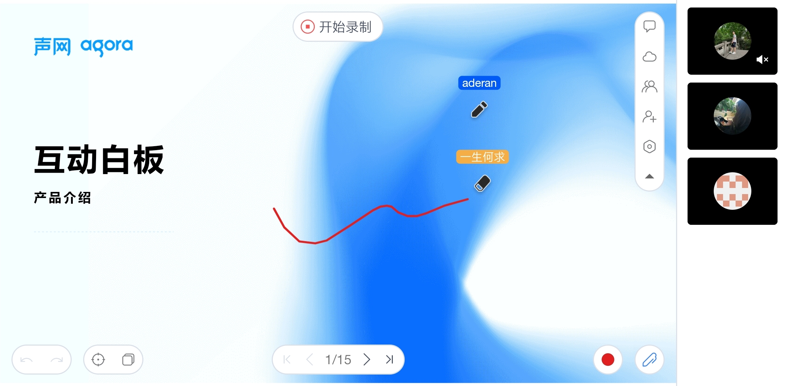

    

<!-- 

    

 
-->

    <h1>Agora Flat Android</h1>
    
Flat Android 是 <a href="https://www.flat.apprtc.cn/">Agora Flat</a> 开源教室的 Android 客户端

    

# 产品体验

- [APP 下载地址][flat-homepage]
- [快速体验 Flat Web][flat-web]

# 特性

- 前后端完全开源
    -   [x] [Flat Web][flat-web]
    -   [x] Flat 桌面端 ([Windows][flat-homepage] and [macOS][flat-homepage])
    -   [x] [Flat Android][flat-android]
    -   [x] [Flat Server 服务器][flat-server]
- 多场景课堂
    -   [x] 大班课
    -   [x] 小班课
    -   [x] 一对一
- 实时交互
    -   [x] 多功能互动白板
    -   [x] 实时音视频（RTC）通讯
    -   [x] 即时消息（RTM）聊天
    -   [x] 举手上麦发言
- 帐户系统
    -   [x] 微信登陆
    -   [x] GitHub 登陆
    -   [ ] 谷歌登陆
- 房间管理
    -   [x] 加入、创建
    -   [ ] 预定房间
    -   [x] 支持周期性房间
    -   [x] 查看历史房间
- 课堂录制回放
    -   [x] 白板信令回放
    -   [x] 音视频云录制回放
    -   [x] 群聊信令回放
-   [x] 多媒体课件云盘
-   [ ] 设备检测
-   [ ] 自动检查更新

# 开发环境

## 开发结构

Flat 试图使用最新 Android 开发库和工具开发应用程序。主要使用一下技术项

* 完全用 Kotlin 编写。
* UI 大部分是用 Jetpack Compose 编写的。
* 始终使用 Kotlin Coroutines 及 Kotlin Flow。
* 使用了许多 Jetpack 架构组件。包括：Room, Lifecycle, ViewModel
* 使用Hilt进行依赖性注入

## 开发工具

本项目使用 Jetpack Compose，你需要最新的 Android Studio Arctic Fox 版本，以便能够构建该应用程序。

## 环境配置

| 变量名                               | 描述                                               | 备注                                                             |
| ------------------------------------ | -------------------------------------------------- | ---------------------------------------------------------------- |
| NETLESS_APP_IDENTIFIER               | 互动白板 Access Key                                | 见: [在 app 服务端生成 Token][netless-auth]                      |
| AGORA_APP_ID                         | Agora 声网 App ID                                  | 用于 RTC 与 RTM。见: [校验用户权限][agora-app-id-auth]           |
| WECHAT_APP_ID                        | [微信开放平台][open-wechat] App ID                 | 见 `网站应用` 里 `AppID`                                         |
| FLAT_SERVER_DOMAIN                   | Flat Server 部署的域名地址                         | 如: `flat-api.whiteboard.agora.io`                               |
|                                                                  |

## 免责声明

你可以将 Flat
用于商业用途但请注意我们不接受商业化需求定制与部署支持以及其它客户服务。如有相关需求请前往[灵动课堂](https://www.agora.io/cn/agora-flexible-classroom)。

[flat-homepage]: https://www.flat.apprtc.cn/

[flat-web]: https://web.flat.apprtc.cn/

[flat-server]: https://github.com/netless-io/flat-server

[flat-android]: https://github.com/netless-io/flat-android

[open-wechat]: https://open.weixin.qq.com/

[netless-auth]: https://docs.agora.io/cn/whiteboard/generate_whiteboard_token_at_app_server?platform=RESTful

[agora-app-id-auth]: https://docs.agora.io/cn/Agora%20Platform/token#a-name--appidause-an-app-id-for-authentication

[cloud-recording]: https://docs.agora.io/cn/cloud-recording/cloud_recording_api_rest?platform=RESTful#storageConfig

[cloud-recording-background]: https://docs.agora.io/cn/cloud-recording/cloud_recording_layout?platform=RESTful#background